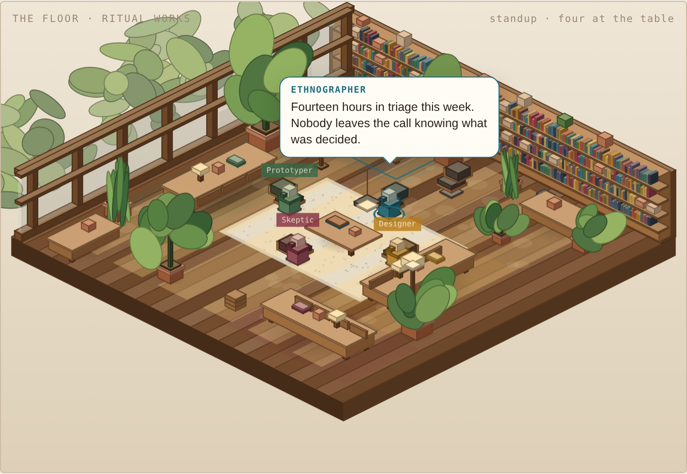

# Ritual Works

**A culture design team that helps you turn a recurring tension into a small,
responsible experiment your group can actually try.**



**[Meet the team in the room →](https://kursatozenc.github.io/ritual-works/)**

You bring the real situation, lived context, judgment and consent. Four AI
teammates bring different strengths:

| Teammate | Strength | Important limit |
|---|---|---|
| **The Ethnographer** · Workplace Research | Creates evidence-grounded research artifacts, insights and opportunity framings before anyone jumps to a solution | Cannot observe your workplace, invent a representative person or select the design direction; it only knows what you share |
| **The Designer** · Ritual Designer | Imagines small practices that fit into everyday work | Cannot decide what is right for your group |
| **The Challenger** · Skeptic | Tests whether an idea is useful, realistic and safe | Must say what evidence would change its mind |
| **The Experimenter** · Prototyper | Prepares a short real-world trial and helps you learn from it | Cannot run the trial or invent its results |

**You are the team lead.** You choose the focus, decide what is worth trying,
involve the people affected and stop ideas that do not fit. The teammates never
make those decisions for you.

## Start here — no technical experience needed

Use the **[Culture Design Field Studio](https://kursatozenc.github.io/ritual-works/student.html)**.
It shows how to add the team to a ChatGPT or Claude Project once, then choose
one teammate in each focused conversation. You do not need to install anything,
understand Markdown or use a developer tool.

If you would rather see the journey before trying it, read
**[a small fictional example](examples/README.md)**.

You will:

1. Share anonymized notes from a real situation.
2. Review what the Ethnographer notices.
3. Choose the recurring moment you want to work on.
4. Decide whether a small repeated practice is the right response.
5. Compare three ideas from the Designer.
6. Put one through the Challenger's reality check.
7. Prepare a short trial with the Experimenter.
8. Leave the AI, try it with real people, and return with actual observations.

The process pauses for your decision at every important handoff. It also pauses
before the trial because the next step has to happen with people, not AI.

## What counts as useful starting material?

Useful material describes something that actually happened:

> At Monday's planning meeting, the facilitator asked for concerns. Nobody
> responded. Afterward, three people raised concerns privately.

This is too general to support the work:

> Our team has a communication problem.

Rough bullet points are welcome. You can use your own observation notes, an
anonymized transcript, interview notes or a summary of several real moments.
Remove names and sensitive details, and make sure you have permission to use
the material.

## What do we mean by a ritual?

Here, a ritual is a small, repeatable practice that helps a group handle or
mark an important moment. It does not need to be ceremonial. A two-minute check
at the end of an existing meeting can be a ritual.

Not every culture problem needs one. Problems rooted in workload, authority,
staffing, incentives, policy or harmful leadership may require a structural
response instead. The team will help you notice when a ritual is the wrong
tool.

## Studio version — work with the four teammates separately

The studio version makes every role and handoff visible. It is useful for
classes, facilitators and culture practitioners.

### Project version

Copy the short
[`Project Instructions`](docs/downloads/Project-Instructions.txt) into a
ChatGPT or Claude Project and upload the
[`Culture Design Team Guide`](docs/downloads/Culture-Design-Team-Guide.md). This
keeps the detailed methods available across conversations while using one role
at a time.

### One-time copy-and-paste version

Open [`prompts/`](prompts/), read the
[`Team Constitution`](prompts/TEAM-CONSTITUTION.md), and use the four
self-contained prompts in [`prompts/teammates/`](prompts/teammates/) in order.
This is the best way to study or modify how the team and each role work.

### Claude Code version

Claude Code can coordinate file handoffs between teammates:

```text
cd ritual-works && claude
/ritual-cycle my-notes.md "Platform Eng"
```

Each cycle gets its own numbered folder under `rituals/`.

## The team rules

- Nobody invents observations.
- The team lead chooses the focus and the idea to test.
- The Challenger cannot object without saying what would change its mind.
- A ritual cannot hide a structural problem.
- Nothing runs without the agreement of a real group, a named owner and a
  review date.
- A trial plan is not a trial result. Results are written only after evidence
  comes back from real people.
- Every handoff is reviewed and signed by a person.

## Human checkpoint

Every result that crosses from one teammate to the next carries an `Agent
caution` written by the teammate and a checkpoint completed by the human:

```text
signed:     <name>
date:       <date>
changed:    what I changed from the draft, and why
decision:   what I decided at this handoff
reason:     why
distrust:   what the next teammate should not take on faith
```

The two cautions are not duplicates. The agent names the weakest part of its
own work; the person records what they still refuse to take on faith. Use the
complete [`Handoff Card`](prompts/HANDOFF-CARD.md).

This makes the human contribution visible. The teammates provide structure and
speed; people provide observation, taste, responsibility and consent.

## Teaching with it

See **[teaching/class-kit.md](teaching/class-kit.md)** for a studio protocol,
human role-play, an exercise comparing a student's field note with the
machine's, consent norms and assessment guidance.

Prompt changes can be checked against the
**[usability and judgment stress tests](tests/usability-stress-tests.md)**.

## What is in the repository?

```text
START-HERE.md         the beginner-friendly Project setup
docs/downloads/       General and course-specific Project materials
.claude/agents/       the four specialist teammates
.claude/commands/     the full cycle coordinator
prompts/              copy-and-paste versions of the team
  TEAM-CONSTITUTION    shared purpose, boundaries and decision rights
  HANDOFF-CARD         visible evidence and human decisions between teammates
  teammates/           four self-contained specialist prompts
rituals/              templates and numbered cycles
teaching/             the class kit
docs/                 the illustrated room
```

## Credit

Built by [Kursat Ozenc](https://github.com/kursatozenc), who writes about
workplace ritual. Licensed MIT — take it, fork it, teach with it.
